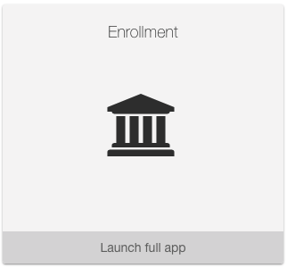
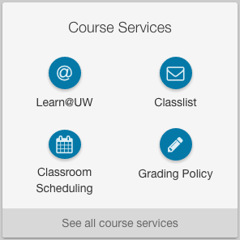
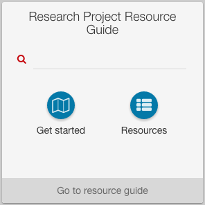
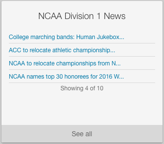
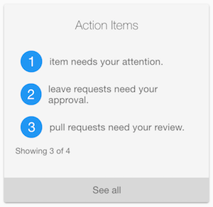
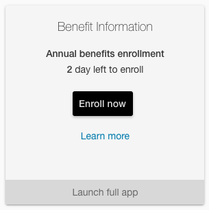
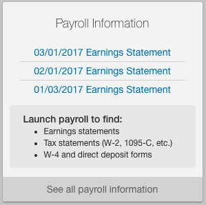

# Widget types and configuration

Widgets are designed to be flexible - users can accomplish a single task or access a single piece of information, or they can access
a collection of related things that will help them accomplish their task.

Widgets can:

* Provide real-time, continuous info about accounts (e.g. list of pay statements in the Payroll Information widget, Wiscard balance in the Wiscard widget)
* Provide snapshots of information that may impact decisions to take action (e.g. adding money to my Wiscard)
* Support periodic user action (e.g. viewing pay statements)
* Allow users to quickly access pieces of the app to complete key or regular tasks (e.g. Course Services, My Professional Development, Course Guide)
* Provide users with at-a-glance information that represents the main use for the widget (e.g. Weather)

## Basic widgets

The barebones widget provides an app title, a large icon, and a launch button with configurable text. It's a simple link to an app or external URL.



### Sample entity file

This code block includes most of the fields needed to configure a widget, but there are additional XML tags (`<portlet-definition>`) you'll need
to create one from scratch. Widgets are app directory entries, so see also [documentation about the app directory][].

```xml
<title>Enrollment</title>
<name>Enrollment</name>
<fname>enrollment-experience</fname>
<desc>Try out the newly redesigned student enrollment experience</desc>
<parameter>
  <name>mdIcon</name>
  <value>fa-university</value>
</parameter>
<parameter>
  <name>alternativeMaximizedLink</name>
  <value>https://enroll.wisc.edu/</value>
</parameter>
<portlet-preference>
  <name>keywords</name>
  <value>enroll</value>
  <value>enrollment</value>
  <value>SOAR</value>
</portlet-preference>
<portlet-preference>
  <name>content</name>
  <readOnly>false</readOnly>
  <value>
    <![CDATA[
      <p>Access the
        <a href="https://enroll.wisc.edu" target="_blank" rel="noopener noreferrer">student enrollment app</a>.
      </p>
    ]]>
  </value>
</portlet-preference>
```

* **title**: The widget title
* **fname**: The technical name of the app entry (lowercase and hyphenated)
* **desc**: Description of the app (visible when hovering the widget's "info" icon
* **mdIcon** parameter: The widget's icon
* **alternativeMaximizedLink** parameter: An optional parameter to use if your widget links to an external URL
* **keywords** portlet-preference: A list of keywords to expose your widget when users search the app directory
* **content** portlet-preference: A required snippet of static content. If your widget has an alternativeMaximizedLink, this content will never be visible, but it's still required.

The above attributes are all you need to configure a basic widget!

***Notes:***

* *DO NOT USE a `widgetType` portlet-preference if you want a basic widget*
* *Some of these parameters may not be required (ex. mdIcon) when using the predefined widget types described below*
* *The above descriptions are in the context of widgets only. Most entity file attributes have other functions within the portal. Ask your portal development team if you want to know more about entity files.*

# Predefined widget types

+ List of links
+ Search with links
+ RSS widget

## Advantages of widget types

Widget types provide a predefined standard template that can do a lot more than a basic widget while saving you the trouble of creating a custom design.

+ It is less development effort to compose configuration and data for an existing widget type than to develop a novel widget.
+ All defined types come with built-in accessibility features to ensure that screen reader users get the best experience possible.
+ Widget types are maintained as part of the uportal-home product, so usages of these types will less often need developer attention to keep them looking up-to-date and working well.
+ Widget types separate configuration (widgetConfig) and data (backing JSON web service) from the implementation of the markup for the widget (widget type).
+ Widget types are more amenable to automated unit testing than are ad-hoc custom widgets.

## How to use

Follow these steps for each of the predefined widget types described in this doc:

1. Follow the "when to use" guidance to select the widget type that will best suit your needs
2. Add the appropriate `widgetType` value to your app's entity file (see widget type's sample code)
3. Add a `widgetConfig` to your app's entity file (see widget type's sample code)

### List of links



```xml
<name>widgetType</name>
<value>list-of-links</value>
```

#### When to use `list-of-links`

Use `list-of-links` to present 2 to 6 links, dynamically sourced or statically
configured.

#### Additional entity file configuration

```xml
<portlet-preference>
  <name>widgetType</name>
  <value>list-of-links</value>
</portlet-preference>
<portlet-preference>
  <name>widgetConfig</name>
  <value>
    <![CDATA[{
      "launchText":"Launch talent development",
      "links": [
        {
          "title":"All courses and events",
          "href":"https://www.ohrd.wisc.edu/home/",
          "icon":"fa-at",
          "target":"_blank"
        },
        {
          "title":"My transcript",
          "href":"https://www.ohrd.wisc.edu/ohrdcatalogportal/LearningTranscript/tabid/57/Default.aspx?ctl=login",
          "icon":"fa-envelope-o",
          "target":"_blank"
        }
      ]
    }]]>
  </value>
</portlet-preference>
```

#### Icons

Preferred: icons are Material Icons, referenced like `invert_colors` (lowercase,
no prefix, underscores in place of spaces. )

Deprecated: icons can be Font Awesome icons, referenced like `fa-envelope-o`
(lowercase, `fa-` prefix, dashes as is typical for Font Awesome references).

Using both Material and Font Awesome icons together can yield visual
misalignment of the link icons.

#### Sourcing list of links content from a URL

The `list-of-links` content can be stored directly in `widgetConfig`, as above.
This allows managing this data in the portlet registry as a
`portlet-preference`.

Alternatively, the portlet publication can declare a URL from which the actual
links content will be sourced. For dynamic link content:

1. Omit the "links" entry in the widgetConfig JSON.
2. Instead add `"getLinksURL": "true"` in the widgetConfig JSON.
3. Configure the `widgetURL` portlet-preference with the location of the dynamic
content.

Example of how the `widgetURL` should respond (note the `content.links` path):

```json
{
  "content": {
    "links": [
      {
        "href": "https://public.predev.my.wisc.edu",
        "icon": "fa-clock-o",
        "target": "_blank",
        "title": "predev"
      },
      {
        "href": "https://public.test.my.wisc.edu",
        "icon": "fa-calendar-times-o",
        "target": "_blank",
        "title": "Test"
      },
      {
        "href": "https://public.qa.my.wisc.edu",
        "icon": "fa-calendar-times-o",
        "target": "_blank",
        "title": "QA"
      },
      {
        "href": "https://public.my.wisc.edu",
        "icon": "fa-calendar-times-o",
        "target": "_blank",
        "title": "Production"
      },
      {
        "href": "https://it.wisc.edu/services/myuw",
        "icon": "fa-calendar-times-o",
        "target": "_blank",
        "title": "Learn more & make contact"
      }
    ]
  }
}
```

#### Guidance about `list-of-links`

* Omitting `launchText` suppresses the launch button
  at the bottom of the list-of-links widget. This is appropriate when there's
  nothing more to launch, that is, when the list-of-links widget presents
  all the intended links and that's all there is to it.
* Avoid using a `list-of-links` widget to display one link.
  Instead, use the name and `alternativeMaximizedLink` of
  [the app directory entry](http://uportal-project.github.io/uportal-home/app-directory)
  to represent the link. This provides a more usable click surface, a simpler
  and cleaner user experience, and achieves better consistency with other
  just-a-link widgets in MyUW.
* `list-of-links` presents different quantities of links differently. 1 to 4
  links present as `circle-button`s. 5 to 6 links present as a more
  traditional-style list. Zero links presents as a basic widget.
* Use brief sentence-case link titles. `list-of-links` truncates link titles to
  24 characters.

### Search with links



```xml
<name>widgetType</name>
<value>search-with-links</value>
```

#### When to use `search-with-links`

* Your app has built-in search
* (optional) and you want to display up to 2 links

#### Additional entity file configuration

```xml
<portlet-preference>
  <name>widgetType</name>
  <value>search-with-links</value>
</portlet-preference>
<portlet-preference>
  <name>widgetConfig</name>
  <value>
    <![CDATA[{
      "actionURL":"https://rprg.wisc.edu/search/",
      "actionTarget":"_blank",
      "actionParameter":"q",
      "launchText":"Go to resource guide",
      "links":[
        {
          "title":"Get started",
          "href":"https://rprg.wisc.edu/phases/initiate/",
          "icon":"fa-map-o",
          "target":"_blank"
        },
        {
          "title":"Resources",
          "href":"https://rprg.wisc.edu/category/resource/",
          "icon":"fa-th-list",
          "target":"_blank"
        }
      ]
    }]]>
  </value>
</portlet-preference>
```

#### Guidance about `search-with-links`

+ Use sentence case in the titles of the links.

### RSS widget



```xml
<name>widgetType</name>
<value>rss</value>
```

#### When to use `rss`

* You want to display an RSS feed right on your MyUW home page

#### Additional entity file configuration

```xml
<portlet-preference>
    <name>widgetType</name>
    <value>rss</value>
</portlet-preference>
<portlet-preference>
    <name>widgetURL</name>
    <value>/rss-to-json/rssTransform/prop/campus-news</value>
</portlet-preference>
<portlet-preference>
    <name>widgetConfig</name>
    <value>
      <![CDATA[{
        "lim": 4,
        "titleLim": 30,
        "showdate": true,
        "showShowing": true
      }]]>
    </value>
</portlet-preference>
```

* **lim**: The number of items to show. Any number greater than 6 will default to 6 (due to space limitations). Use a smaller number for feeds that are infrequently updated.
* **titleLim**: Limit the length (in characters, including spaces) of feed titles. This number should be between 30 and 60 (depending on whether you're showing dates or not).
When this limit results in truncation, `rss` adds an `md-tooltip` with the full
title.
* **showdate**: T/F show each feed item's published date. The date format is "M/d/yy" (localizable) due to space consideration.
* **showShowing**: T/F Show the "Showing \[x] out of \[y]" message (to communicate that there is more to see). Set this to true if your feed has frequent updates.

#### Guidance about `rss`

Note the additional required value in the entity file:

* **widgetUrl**: The URL of the *JSON representation of the* RSS feed you want to display

The [rssToJson][] microservice is a fine way to convert desired RSS feeds into the required JSON representation.

### Action Items List



```xml
<name>widgetType</name>
<value>action-items</value>
```

#### When to use `action-items`

* You want to display a list of quantity-based items, with quantities that are expected to change. For example, a manager who has to approve time off could see "5 leave requests need your approval".

#### Additional entity file configuration

```xml
<portlet-preference>
    <name>widgetType</name>
    <value>action-items</value>
</portlet-preference>
<portlet-preference>
    <name>widgetConfig</name>
    <value>
      <![CDATA[{
        "actionItems": [
          {
            "textSingular": "item needs your attention.",
            "textPlural": "items need your attention.",
            "feedUrl": "example/path/to/individual-item-feed",
            "actionUrl": "example/path/to/take/action"
          }
        ]
      }]]>
    </value>
</portlet-preference>
```

* **actionItems**: A simple array of items. Each item should have values for each of the four attributes.
* **textSingular**: Text to show when there is only 1 item of this type requiring attention.
* **textPlural**: Text to show when there are multiple items of this type requiring attention.
* **feedUrl**: The URL to fetch the *JSON representation* of the quantity of items needing attention.
* **actionUrl**: The URL where action can be taken for this specific item. If no such URL exists, use the same URL as you use for the "See all" launch button.

#### Guidance about `action-items`

If there are multiple action item types to display, the widget will display the first 3 in the list. If there are more than 3, it will display a note that says "Showing 3 of \[x]".

The endpoint used for **feedUrl** should return a simple JSON object containing a "quantity" key with a number for a value. For example:

```json
  {
    "quantity": 5
  }
```

### Time-sensitive content widget



```xml
<name>widgetType</name>
<value>time-sensitive-content</value>
```

#### When to use `time-sensitve-content`

* You want to display a call to action during a defined period of time, and a basic widget the rest of the time.

*Note: This is an experimental widget type and is subject to change*

#### Additional entity file configuration

```xml
<portlet-preference>
    <name>widgetType</name>
    <value>time-sensitive-content</value>
</portlet-preference>
<portlet-preference>
    <name>widgetConfig</name>
    <value>
      <![CDATA[{
        "callsToAction": [
          {
            "activeDateRange": {
              "templateLiveDate": "09-09",
              "takeActionStartDate": "09-11",
              "takeActionEndDate": "09-18T12:00",
              "templateRetireDate": "09-20T10:00"
             },
             "actionName": "Annual benefits enrollment",
             "daysLeftMessage": "to change benefits",
             "lastDayMessage": "Today is the last day to enroll!",
             "actionButton": {
               "url": "https://www.hrs.wisconsin.edu/psp/hrs-fd/EMPLOYEE/HRMS/c/W3EB_MENU.W3EB_ENR_SELECT.GBL",
               "label": "Enroll now"
             },
             "learnMoreUrl": "https://www.wisconsin.edu/abe/",
             "feedbackUrl": ""
           },
           {
             "activeDateRange": {
               "templateLiveDate": "2017-03-09",
               "takeActionStartDate": null,
               "takeActionEndDate": null,
               "templateRetireDate": "2017-03-19"
             },
             "actionName": "Some other call to action",
             "actionButton": {
               "url": "https://www.google.com",
               "label": "Do the thing"
             },
             "learnMoreUrl": "www.google.com",
             "feedbackUrl": "www.google.com"
           }
         ]
      }]]>
    </value>
</portlet-preference>
```

#### About entity file values

* **callsToAction**: The containing array for one or more objects with attributes related to making a call to action.
* **activeDateRange**: An object used to determine when to switch to the time-sensitive content, with the following attributes:
  * **templateLiveDate**: The date when the widget should switch from basic content to time-sensitive content. See "Guidance" heading below for suggested formats and options.
  * **takeActionStartDate**: *(optional)* The date when action can be taken. Provide a value if you want the widget to communicate when taking action will be possible (e.g. "Begins September 11th, 2018"). See "Guidance" heading below for suggested formats and options.
  * **takeActionEndDate**: *(optional)* The date when the action can no longer be taken. Required if `takeActionStartDate` is present. Provide a value if you want the widget to communicate when the action stopped being available (e.d "Ended September 20th, 2018"). See "Guidance" heading below for suggested formats and options.
  * **templateRetireDate**: *(optional)* The date when the widget should switch back to displaying basic content. See "Guidance" heading below for suggested formats and options.
* **actionName**: The name of the action users can take (e.g. "Annual benefits enrollment").
* **daysLeftMessage**: *(optional)* The language to display during the countdown of remaining days. The widget will always display "# days left". Provide a value if you want to add text after the default text (e.g. A `daysLeftMessage` with the value "to change benefits" would result in the message: "# days left to change benefits").
* **lastDayMessage**: *(optional)* A special message to display on the last day that taking action is possible. If no value is provided, the widget will show "1 day left" on the last day.
* **actionButton**: An object to configure how the action button appears, with the following required attributes:
  * **url**: The url where a user can take action
  * **label**: The text the button should display
* **learnMoreUrl**: *(optional)* Provide a url if you want the widget to display a link for users to get more information.
* **feedbackUrl**: *(optional)* Provide a url if you want the widget to display a link where users can give feedback about the taking action.

#### Guidance about `time-sensitive-content`

##### Date formatting

Provided dates **MUST** match one of the following formats:
+ `'YYYY-MM-DD'` (ex. '2017-09-18'): Use this format if the call to action doesn't happen on the same date every year and if the time of day is unknown or unimportant
+ `'MM-DD'` (ex. '09-18'): Use this format if the date for this action is the same every year
+ `'...THH:MM'` (ex. 09-18T10:00): Append the time in hours and minutes if you want to set a specific time of day

##### How to configure the active date range

+ If you want your widget to warn users that they'll be able to take an action in the near future, you must provide dates for both `templateLiveDate` and `takeActionStartDate`. The former date must be *BEFORE* the latter one. If you only want the template to switch content when users can take action, you only need to provide `templateLiveDate`. During the days between the two dates, the widget will display "Begins `takeActionStartDate`".
+ Similarly, if you want the widget to tell users that a period to take action recently ended, you must provide dates for both `takeActionEndDate` (the date when taking the action stopped being possible) and `templateRetireDate` (the date the widget should go back to showing basic content). The former date must be *BEFORE* the latter one. During the days between the two dates, the widget will display "Ended `takeActionEndDate`".
+ If you only want the widget to show time-sensitive content when that content is actionable, you only have to provide dates for `templateLiveDate` and `templateRetireDate`. During the days between the two dates, the widget will display a countdown of days remaining to take action.

## Other Configuration

### Launch button text
If you provide a `widgetConfig` with any defined widget type (i.e. not a custom widget) with a value for `launchText`, it will replace the text of the
launch button with the provided value, even for non-widgets. Use sentence case in launch button text.

Read more about the [launch button best practices](widget-launch-button.md).

### Maintenance mode
If your widget/application depends on a service that is currently experiencing an outage or planned maintenance, you can
add the `maintenanceMode` attribute to your `widgetConfig` with a value of "true." Widgets in maintenance mode will display
a message communicating that the app is unavailable and the widget will be disabled (unclickable). To turn maintenance mode off,
simply set the attributes value to "false" or remove it from your `widgetConfig` altogether.

Example:

```xml
<portlet-preference>
  <name>widgetConfig</name>
  <value>
    <![CDATA[{
      "launchText" : "See all the Weather",
      "maintenanceMode" : true
    }]]>
  </value>
</portlet-preference>
```

## Custom widgets
Using a JSON service is a great way to have user-focused content in your widgets. Here are the steps you have to take to create your custom JSON-backed widget:

### 1. widgetURL
This is where we will get the data from (in a JSON format). If your JSON feed lives outside of the portal, you will need to setup
a rest proxy for that. Please contact the MyUW team for details and assistance.

```xml
<portlet-preference>
  <name>widgetURL</name>
  <value>/portal/p/earnings-statement/max/earningStatements.resource.uP</value>
</portlet-preference>
```

When your widget is rendered, this service is called via a `GET`. The returned content is stored in the scope variable `content`.

### 2. widgetType
Setting this to `custom` will enable you to provide your own custom template. Be sure to evaluate the out of the box widget types
before creating your own (documentation on those above).

```xml
<portlet-preference>
    <name>widgetType</name>
    <value>custom</value>
</portlet-preference>
```

### 3. widgetTemplate
This is where the template goes. We suggest using a CDATA tag here.

```xml
<portlet-preference>
  <name>widgetTemplate</name>
  <value>
    <![CDATA[
      <div style='margin : 0 10px 0 10px;'>
        <loading-gif data-object='content' data-empty='isEmpty'></loading-gif>
        <ul class='widget-list'>
          <li ng-repeat=\"item in content.report |orderBy: ['-paid.substring(6)','-paid.substring(0,2)'] | limitTo:3\"
              class='center'>
            <a href='/portal/p/earnings-statement/max/earning_statement.pdf.resource.uP?pP_docId={{item.docId}}' target='_blank'>
              <i class='fa fa-bank fa-fw'></i> {{item.paid}} Statement</a>
          </li>
        </ul>
        <div ng-if='isEmpty' style='padding: 10px; font-size: 14px;'>
          <i class='fa fa-exclamation-triangle fa-3x pull-left' style='color: #b70101;'></i>
          <span style='color: #898989;'>We had a problem finding your statements (or you don't have any).</span>
        </div>
        <div style='background-color: #EAEAEA; border-radius:4px;padding:10px; margin-top:10px;'>
          <span class='bold display-block left' style='text-align: left; padding-left: 10px; font-size: 14px;'>
            See all payroll information for more options:
          </span>
          <ul style='text-align: left;list-style-type: disc; font-size: 12px;'>
            <li>See all pay stubs</li>
            <li>Tax statements</li>
            <li>Update direct deposit</li>
          </ul>
        </div>
      </div>
      <launch-button data-href='/portal/p/earnings-statement'
                     data-target='_self'
                     data-button-text='Launch full app'
                     data-aria-label='Launch payroll information'></launch-button>
    ]]>
  </value>
</portlet-preference>
```

#### Accessibility guidance

Creating a custom widget means you'll miss out on built-in accessibility features, like aria-labels for screen reader users. We recommend using the `<launch-button>` directive for
you widget launch button, and providing a simple but meaningful value for the `data-aria-label` attribute.

Read more about the [launch button best practices](widget-launch-button.md).

*Note: If you do not use the launch-button directive, please give your launch button a class of "launch-app-button" to ensure it matches other widgets.*

### 4. widgetConfig

The widget config is a JSON object. Please note it has to be valid JSON. We used the <![CDATA[]]> tag so we didn't have to encode everything.

Currently we only use the evalString to evaluate emptiness. We may add more in the future.

```xml
<portlet-preference>
  <name>widgetConfig</name>
  <value><![CDATA[{ "evalString" : "!$scope.content.report || $scope.content.report.length === 0"}]]></value>
</portlet-preference>
```

By doing just this we were able to generate:




[rssToJson]: https://github.com/UW-Madison-DoIT/rssToJson
[documentation about the app directory]: http://uportal-project.github.io/uportal-home/app-directory.html
