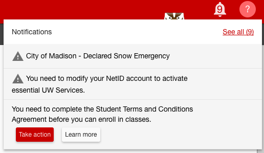
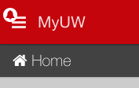
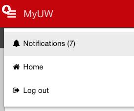

# Notifications in uw-frame

## User-facing content

When you create a notification for uw-frame, its content will be displayed to users in a number of ways.

### Notification bell

On medium and large screens, a bell icon button containing the number of unseen notifications appears in the application's top bar. Clicking the button
brings users to the notifications page for a more detailed view.

[](img/notifications/top-bar-bell.png)

On small screens, a small bell icon without the notification count appears on top of the mobile menu button.

[](img/notifications/mobile-bell.png)

### Mobile menu link

In addition to the bell icon, the mobile menu contains a link to the notifications page that also displays the number of unseen notifications.

[](img/notifications/mobile-link.png)

### Priority notifications

For critical notifications that require a higher degree of visibility, notifications can be designated as "priority" and will appear more prominently, fixed above the
application top bar. In cases when the user has more than one priority notification to view, a generic message will be displayed, featuring the priority notifications
count and a link to the notifications page.

[](img/notifications/priority.png)

### Notifications page

On the notifications page, users can view their notifications, dismiss them, and follow calls to action. They can also click the
'Dismissed' tab to view notifications they've previously dismissed.

Priority notification float to the top of the list and appear with a small icon to the left of the notification's content.

[](img/notifications/notifications-page.png)

## Technical implementation

Notifications depend on a JSON feed containing certain attributes and flags. See the [configuraton](configuration.md) doc for information about how to
point uw-frame to your desired feed.

### Example notification

*Note: All notifications must be contained within the `notifications` array.*

```json
{
  "notifications": [
    {
      "id": 1,
      "groups" : ["Users - Service Activation Required"],
      "title"  : "You need to modify your NetID account to activate essential UW Services.",
      "actionURL" : "https://www.mynetid.wisc.edu/modify",
      "actionAlt" : "Activate Services",
      "dismissable" : true,
      "priority" : false
    }
  ]
}
```

**Attribute breakdown**

- **id**: A unique number to identify the notification. This is used for sort order on the notifications page.
- **groups**: An attribute to optionally show notifications only to specific groups (ex. Manifest groups, uPortal groups). **Must contain at least one value**. Using the "Everyone" group will make
your notification visible to all users. Contact your portal development team for more information about group filtering.
- **title**: The text to be displayed as the notification's main content. **Best practices:**
    - Be concise! Try to limit your notification's title to ~140 characters. Shorter titles improve click-through and are less likely to cause display issues on smaller screens.
    - Use general language and avoid pronouns for broadly visible notifications that don't pertain to specific users' needs (ex. "City of Madison - Declared Snow Emergency").
    - Use the word "You" when the group filtering for a notification is somewhat specific (i.e. Users with unactivated accounts).
- **actionURL**: A URL where users can get more information or respond to calls to action.
- **actionAlt** (*optional*): Applies an aria-label to the notification title. Use this if vision-impaired users might need additional context to understand your notification.
- **dismissable**: Set to true if users should be able to dismiss the notification from their list. This also works for dismissing priority notifications from their fixed position above the top bar.
**This should almost always be true**.
- **priority**: Set to true if the notification is of critical importance. The visibility of the notification will be amplified throughout the UI. **This feature should be used sparingly.**


### Action buttons

If your notification would lead to a page with more links or calls to action, you can save your users some clicks by adding the `actionButtons` attribute to its configuration.
Action buttons can also be used to call more attention to the `actionURL`.


```json
{
  "id": 1,
  ...
  ...
  "actionButtons" : [
    {"label": "Take survey", "url": "/example/survey", "target": ""},
    {"label": "Learn more", "url": "/example/learnMore", "target": "_blank"}
  ]
}

```

**Action button attributes**

- **label**: Text to display. This should be limited to a maximum of three words.
- **url**: A url for the action
- **target** (*optional*): The `target` attribute for the button's `<a>` tag (ex. "_blank", "_self", etc)


